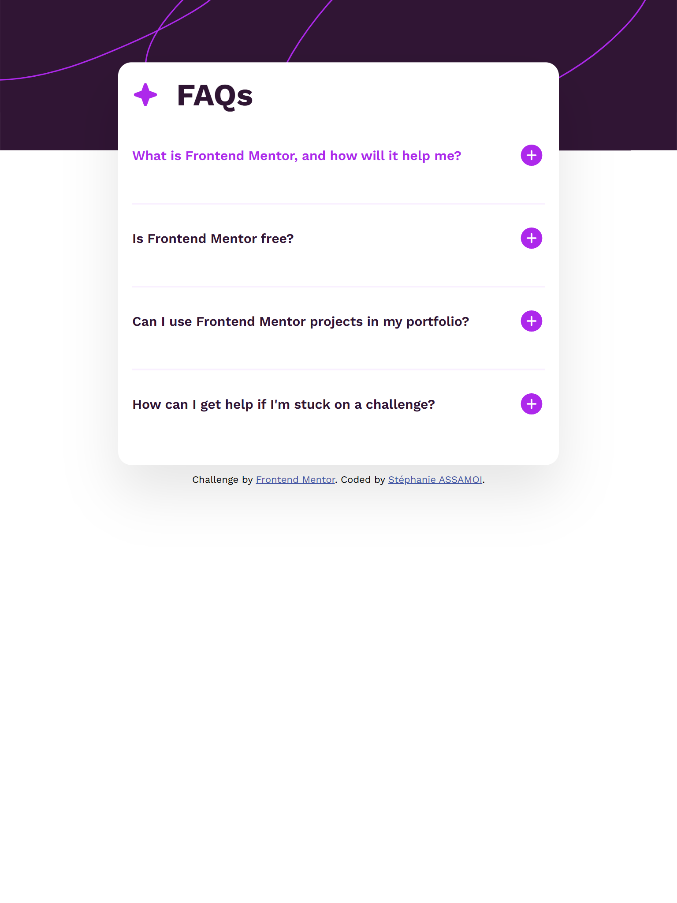
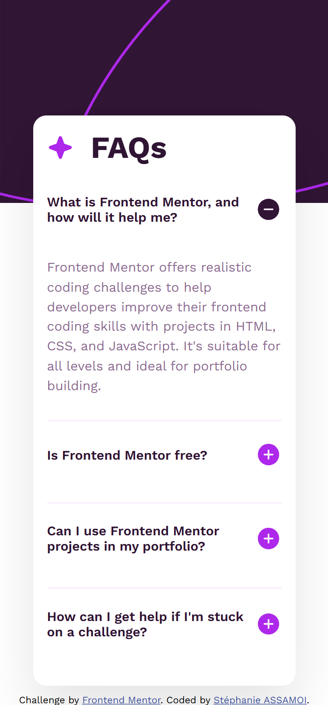
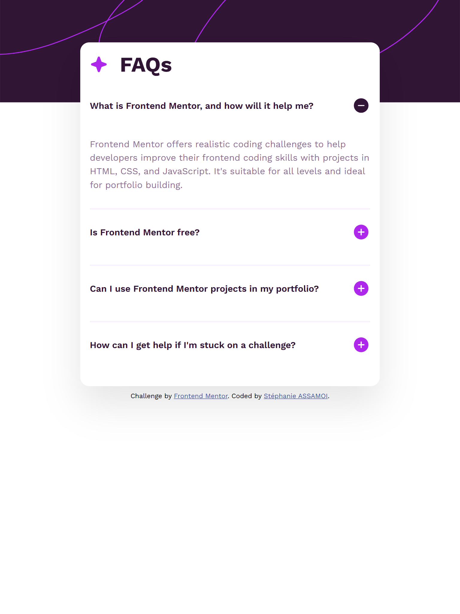
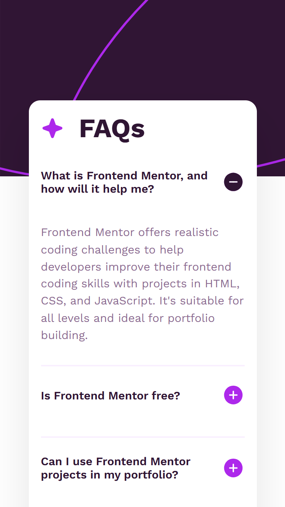

# Frontend Mentor - FAQ accordion solution

This is a solution to the [FAQ accordion challenge on Frontend Mentor](https://www.frontendmentor.io/challenges/faq-accordion-wyfFdeBwBz). Frontend Mentor challenges help you improve your coding skills by building realistic projects. 

### Screenshot

### Links

- Solution URL: [Add solution URL here](https://github.com/Stephanie0905/FAQ-accordion.git)
- Live Site URL: [Add live site URL here](https://stephanie0905.github.io/FAQ-accordion/)

## My process

### Built with

- HTML5 
- CSS 
- Flexbox
- Vanilla JS

